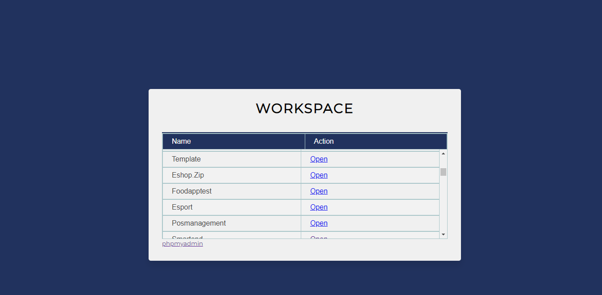

# Localhost Custom

A Custom index.php for your localhost.

## Install

1. Clone or Download repository `https://github.com/ibobdb/localhost-custom-ui.git`.
2. Copy `index.php` to your root directory of localhost (`:\xampp\htdocs`).
3. Link the css file `<link rel="stylesheet" href="localhost-custom/style.css">` in file `index.php`, you can change the redirect link to the folder of your choice.

## How it looks

;
